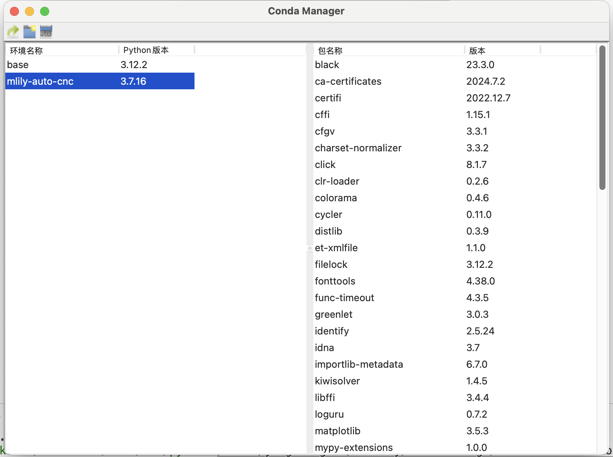

# Conda 环境管理器

一个基于wxPython的图形化Conda环境管理工具，提供直观的界面来管理Python虚拟环境。



## 功能特点

- 可视化管理Conda环境
- 显示所有环境及其Python版本
- 创建新的Python环境（支持多个Python版本）
- 删除现有环境
- 查看环境中已安装的包及版本
- 快速打开环境所在文件夹
- 一键打开终端并激活环境
- 实时进度显示

## 系统要求

- Python 3.7+
- Conda 已安装并配置环境变量
- 支持 Windows/macOS/Linux

## 安装依赖

```bash
pip install -r requirements.txt
```

## 运行方式

```bash
python src/main.py
```

## 目录结构

- `src/`: 源代码目录
  - `gui/`: 图形界面相关代码
  - `main.py`: 主程序入口
  - `conda/`: Conda环境管理相关代码
  - `system/`: 系统操作相关代码
- `requirements.txt`: 依赖库列表
- `README.md`: 项目说明文档

## 使用说明

1. 查看环境列表：
   - 启动程序后，左侧面板显示所有Conda环境
   - 每个环境显示其名称和Python版本

2. 查看包信息：
   - 点击任意环境，右侧面板显示该环境已安装的包
   - 显示包名称和版本号

3. 创建新环境：
   - 点击工具栏的"新建环境"按钮
   - 输入环境名称
   - 选择Python版本
   - 等待创建完成

4. 删除环境：
   - 选择要删除的环境
   - 点击工具栏的"删除环境"按钮
   - 确认删除操作

5. 环境操作：
   - 右键点击环境可以：
     - 打开环境所在文件夹
     - 打开终端并自动激活环境

## 开发说明

项目采用模块化设计，遵循SOLID原则：

- `conda/manager.py`: Conda操作核心类
- `system/os_operations.py`: 系统相关操作
- `gui/`: 图形界面相关模块
  - `main_frame.py`: 主窗口
  - `panels.py`: 列表面板
  - `dialogs.py`: 对话框

## 依赖项

- wxPython: GUI框架
- conda: Python环境管理

## 注意事项

1. 确保系统已正确安装并配置Conda
2. 环境创建过程中请耐心等待
3. 删除环境操作不可恢复，请谨慎操作

## 许可证

MIT License

## 更新日志

### v1.0.0
- 初始版本发布
- 基本的环境管理功能
- 支持主流操作系统